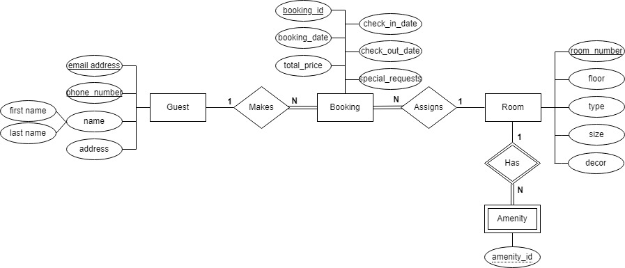

# Challenge 1:

Any Java version above 11.0.17 should work. Tested on Oracle OpenJDK 11.0.17 and 19.0.1 SDKs successfully.

## Installation Guide (recommended)

### 1. Clone the repository
```git clone https://github.com/aslam341/ExpenseTracker.git```

### 2. Open folder with IntelliJ IDEA IDE
Ensure project settings has correct Java SDK.

### 3. Run main or test
    a. Main
    Click on "Run Main.main()" when you hover your mouse over the file in src/main/Main in project directory.

    b. Test
    Junit5 is required for tests.
    Click on "Run "All Tests" when you hover your mouse over the file in src/test in project directory.

## Installation Guide (using terminal)

### 1. Clone the repository
```git clone https://github.com/aslam341/ExpenseTracker.git```

### 2. Change into the project directory
```cd ExpenseTracker```

### 3. Compile the program in a separate 'classes' directory
```javac src/main/*.java -d classes```

### 4. Run the program
```java -cp classes main.Main```

### 5. Follow the instructions from the program

#### (If you have trouble compiling the program or running the program, you can alternatively run the run.sh script to quickly get the program running)


## Assumptions
1. A difference of +-$0.005 owed does not matter too much. In the first example test case, for the following input:

    Ali,40.105 

    Bob,40.105 

    Charlie,10

    The output should be that Charlie pays them to Ali and Bob, which would be $10.035, but we shall round it down to $10.03 each.


## Architecture Decisions

1. Use of BigDecimal instead of Double to represent currency
For higher precision values, which is especially important when dealing with currency.


# Challenge 2:



#### The above entity-relationship diagram follows Chen's notation.

## Assumptions
1. Each guest can make multiple bookings.
2. Each room can be booked in multiple times by different guests.
3. There are no overlapping bookings for a room.
4. A guest's period of stay is throughout the duration of the booking.
5. Different rooms can have different amenities (e.g. Jacuzzi tubs, high speed wifi, private balcony, accessibility features like grab bars, etc...).